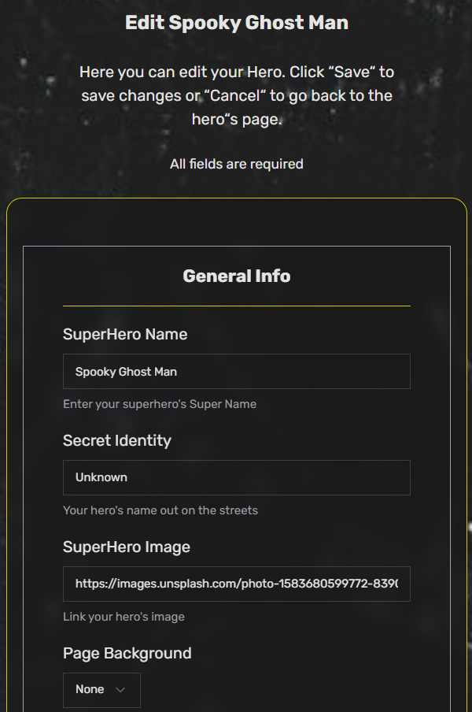

# CustomHero.com

In this web app you can sign up and create your own SuperHero with custom Appearance, Powerstats, Biography and more!

## Screenshots

**Desktop**

**Tablet**

**Mobile**

## Features

-   Display dynamic superhero cards
-   User authentication and registration via Kinde
-   Custom hero creation for signed-in users
-   Form validation with Zod and React Hook Form
-   Beautiful and responsive UI using Tailwind CSS, Radix UI, and React Icons
-   Toast notifications with React Hot Toast

## Tech Stack

-   Next.js
-   React
-   Tailwind CSS
-   React Icons
-   React Hot Toast
-   React Hook Form
-   shadcn/ui Components:
    -   Aspect Ratio
    -   Label
    -   Select
    -   Form
    -   Input
    -   Textarea
    -   Card
    -   Button
-   Zod - Schema validation
-   Kinde - Authentication and user management
-   Prisma - ORM for database access

### 🔗 Links

