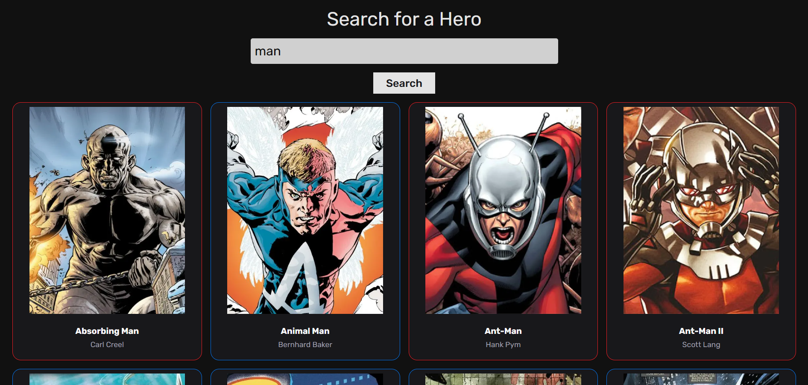
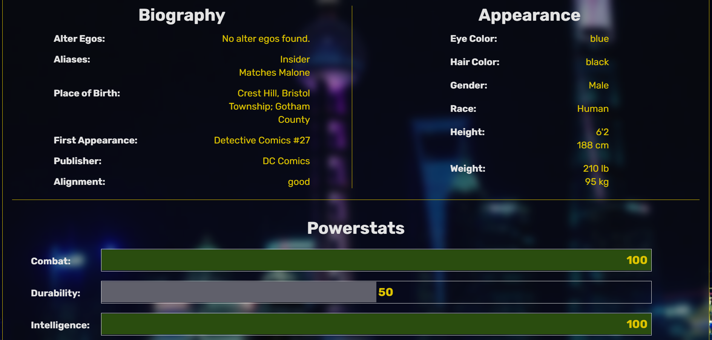

# SuperHero Stats

In this web app you can search for superheroes and click on their card to see their stats. Appearance, Powerstats, Biography and more! Also, you can sign up and create your own SuperHero!

#### [SuperHero Stats](https://superhero-stats-version2.vercel.app/)

## API

#### [SuperHero API](https://superheroapi.com/index.html)

## Screenshots

**Desktop**

**Tablet**

**Mobile**

## Features

-   Display dynamic superhero cards
-   User authentication and registration via Kinde
-   Custom hero creation for signed-in users
-   Form validation with Zod and React Hook Form
-   Beautiful and responsive UI using Tailwind CSS, Radix UI, and React Icons
-   Toast notifications with React Hot Toast

## Tech Stack

-   Next.js
-   React
-   Tailwind CSS
-   React Icons
-   React Hot Toast
-   React Hook Form
-   shadcn/ui Components:
    -   Aspect Ratio
    -   Label
    -   Select
    -   Form
    -   Input
    -   Textarea
    -   Card
    -   Button
-   Zod - Schema validation
-   Kinde - Authentication and user management
-   Prisma - ORM for database access

### 🔗 Links

